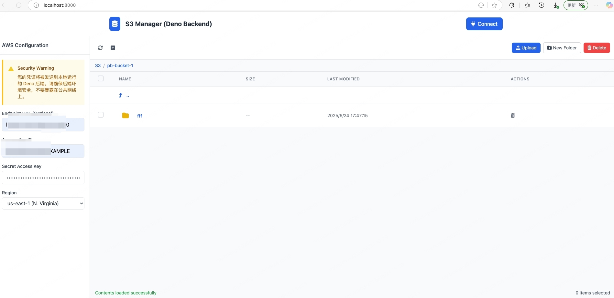

Here's a well-structured README.md for your S3 Manager project:

```markdown
# S3 Manager (Deno Backend)

A web-based interface for managing AWS S3 buckets and objects with a Deno backend.



## Features

- **Bucket Management**:
  - List all S3 buckets in your account
  - Create new buckets
  - Navigate through bucket contents
  - Delete buckets (when empty)

- **File Operations**:
  - Browse files and folders
  - Upload multiple files via drag-and-drop or file selection
  - Create new folders
  - Delete files and folders
  - View file details (size, last modified)

- **Authentication**:
  - Connect using AWS credentials (access key + secret key)
  - Supports custom S3-compatible endpoints
  - Credentials persisted locally (optional)
  - Supports all AWS regions

## Security Notice

⚠️ **Important Security Information**
Your AWS credentials will be sent to a locally running Deno backend. Please ensure:
- The backend environment is secure
- Never expose the backend to public networks
- Use minimal required permissions for your access key

## Getting Started

### Prerequisites

- [Deno](https://deno.land/) installed on your system
- AWS credentials with appropriate S3 permissions

### Installation

1. Clone this repository
2. Start the Deno backend server:
   ```bash
   deno run --allow-net --allow-env server.ts
   ```
3. Open `index.html` in your web browser

### Configuration

Configure your AWS credentials either:
- Directly in the web interface
- By setting environment variables for the Deno backend:
  ```
  AWS_ACCESS_KEY_ID
  AWS_SECRET_ACCESS_KEY
  AWS_REGION (optional)
  AWS_ENDPOINT (for S3-compatible services)
  ```

## Architecture

```
Frontend (HTML/CSS/JS)  ←HTTP→  Deno Backend  ←AWS SDK→  AWS S3
```

- **Frontend**: Pure client-side web interface
- **Backend**: Deno server handling:
  - Authentication
  - S3 API calls
  - File upload processing
  - Security validation

## Usage

1. Connect with your AWS credentials
2. Browse buckets and files
3. Perform operations using:
   - Main toolbar buttons
   - Right-click context menu (future)
   - Keyboard shortcuts (future)

## Development

To extend this project:

```bash
# Run development server with watch mode
deno run --allow-net --allow-sys --allow-env --allow-read --allow-write src/main.ts
```

For Docker development:

# Build with development flags
```
docker build -t s3-manager-dev  .
# Run with volume mounting for live reload
docker run -p 8000:8000 -v $(pwd):/app s3-manager-dev
```

Features to consider adding:
- File previews
- Batch operations
- Permission management
- Sharing URLs
- Search functionality

## License

MIT License - See [LICENSE](LICENSE) for details.
```

Notes:
1. You might want to add an actual screenshot as `screenshot.png`
2. Adjust the backend filename (`server.ts`) to match your actual implementation
3. Add any additional security considerations specific to your implementation
4. The structure follows standard open-source project documentation practices
5. Consider adding a CONTRIBUTING.md if you want others to contribute